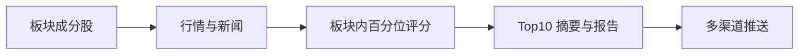
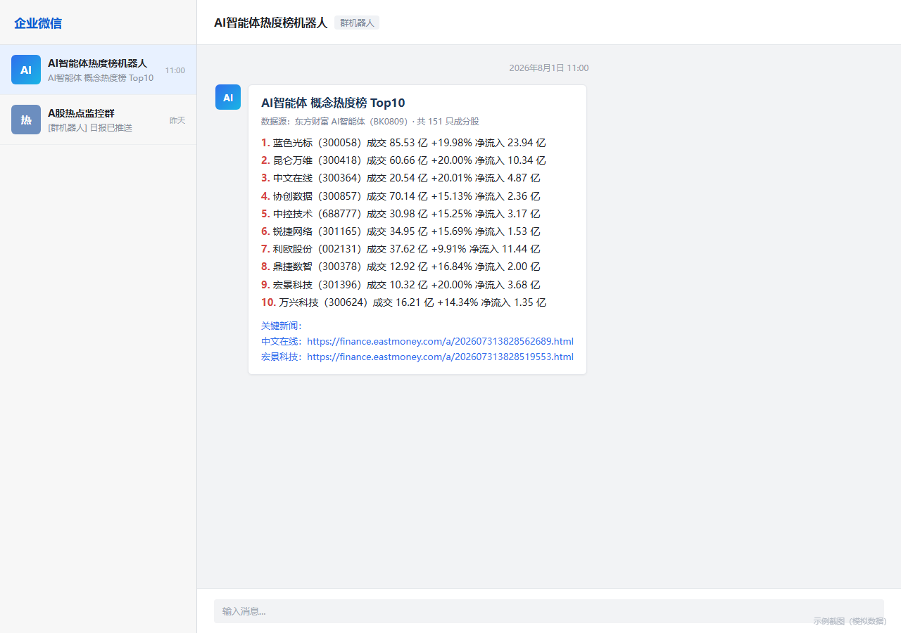

<p align="center"></p>

<h1 align="center">Market Heat Radar · A 股概念热度榜</h1>

<p align="center">从板块行情到 Top10 摘要，再到多渠道推送，让每日信息整理形成完整工作流。</p>

<p align="center">  </p>

<p align="center"><a href="#工作流">工作流</a> &nbsp; · &nbsp; <a href="#快速开始">快速开始</a> &nbsp; · &nbsp; <a href="#调度与验证">调度与验证</a> &nbsp; · &nbsp; <a href="#交付物">交付物</a></p>

---

## 项目概览

| 方向 | 内容 |
| --- | --- |
| **热度评分** | 成交额、涨跌幅、资金流与新闻提及 |
| **自动调度** | 默认北京时间 11:00，支持手动执行 |
| **报告交付** | 短摘要、新闻链接与五类推送渠道 |

## 工作流



默认概念板块为 `BK0809`，可在配置中调整。成分股数量随数据源变化，以当次抓取为准。

| 指标 | 默认权重 |
| --- | --- |
| 成交额 | 40% |
| 涨跌幅 | 30% |
| 资金净流入 | 20% |
| 新闻提及 | 10% |

每只股票输出 49 字以内摘要和新闻链接。支持企业微信、飞书、钉钉、Telegram 与邮件，各渠道可独立启停。

## 快速开始

Windows 用户可双击 [`submit2/代码/run.bat`](submit2/代码/run.bat)。源码运行需要 Python 3 和可用的 Tkinter：

```powershell
git clone https://github.com/QIANLING-0831/A-.git
cd .\A-\submit2\代码
py -3 app.py
```

只执行一次、不打开窗口：

```powershell
py -3 -m core.workflow_cli
```

首次运行会生成本机 `config.json`。在界面中配置推送渠道，使用“测试已启用渠道”验证后保存。Webhook、Bot Token 与邮箱授权码属于敏感配置，请勿提交到仓库。

## 调度与验证

默认每天北京时间 **11:00** 执行。窗口内调度随窗口关闭而停止；需要独立调度时，让 Windows 任务计划程序以代码目录为工作目录运行 `py -3 -m core.workflow_cli`。

```powershell
py -3 -m unittest discover -s tests
```

## 交付物

| 文档 | 用途 |
| --- | --- |
| [部署说明](submit2/部署说明.md) | 启动、定时、渠道配置与打包 |
| [代码说明](submit2/代码/README.md) | 模块职责和源码使用方法 |
| [流程图](submit2/流程图.md) | 完整自动化流程 |
| [提交包](submit2/README.md) | 交付文件索引 |



> 图片为演示用模拟截图，不表示真实渠道已成功推送。榜单用于自动化研究演示；行情和新闻以原始数据源为准，输出不构成投资建议。

仓库尚未包含许可证文件，使用或再分发前请与作者确认授权。
