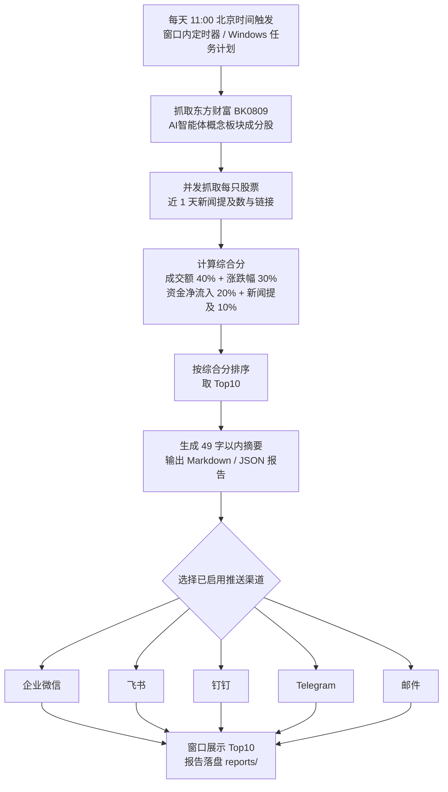

# 自动化工作流流程图

## Mermaid 流程图



## ASCII 流程图

```text
每天 11:00（北京时间）
        |
        v
抓取东方财富 BK0809 概念板块成分股
        |
        v
并发抓取近 1 天新闻提及数与新闻链接
        |
        v
综合分 = 成交额40% + 涨跌幅30%
        + 资金净流入20% + 新闻提及10%
        |
        v
按综合分排序，取 Top10
        |
        v
生成 49 字以内摘要 + Markdown/JSON 报告
        |
        v
推送：企业微信 / 飞书 / 钉钉 / Telegram / 邮件
        |
        v
窗口展示 Top10 + 报告落盘 reports/
```

## 各环节说明

1. 触发：`core/scheduler.py` 按北京时间计算下次 11:00，窗口内可启停；也支持 Windows 任务计划调用 `core/workflow_cli.py`。
2. 抓取：`core/eastmoney.py` 调用东方财富公开接口，分页获取全部成分股，主域名失败时自动切换备用域名。
3. 新闻：按股票名称并发搜索东方财富资讯，统计近 1 天提及数，取最新 3 条作为关键新闻链接。
4. 评分：四项指标在板块内做百分位归一化，按权重加权，避免不同量纲直接相加。
5. 摘要：先生成完整文案，再按候选从长到短裁剪，保证最终不超过 49 字。
6. 推送：`core/push.py` 将 Markdown/纯文本报告发给已启用渠道，单个渠道失败不影响其他渠道。
